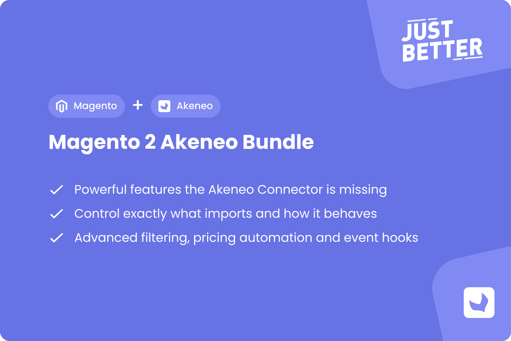

<a href="https://github.com/justbetter/magento2-akeneo-bundle" title="JustBetter Magento 2 Akeneo Bundle">
    
</a>
<h1>JustBeter - Magento 2 Akeneo Bundle</h1>
<a id="readme-top"></a>

[![Latest Version on Packagist][packagist-version-shield]][packagist-version-url]
[![GPL-3.0 License][license-shield]][license-url]
[![Total Downloads][packagist-downloads-shield]][packagist-downloads-url]
[![Stargazers][stars-shield]][stars-url]
[![Issues][issues-shield]][issues-url]
[![Contributors][contributors-shield]][contributors-url]
[![Forks][forks-shield]][forks-url]

<br />
<div align="center">
  <a href="https://justbetter.nl">
    
  </a>

  <h3 align="center">JustBeter - Magento 2 Akeneo Bundle</h3>

  <p align="center">
    Powerful extensions for the Akeneo Connector Community Edition
    <br />
    <a href="https://github.com/justbetter/magento2-akeneo-bundle/issues">Report Bug</a>
    ·
    <a href="https://github.com/justbetter/magento2-akeneo-bundle/issues">Request Feature</a>
  </p>
</div>

<details>
  <summary>Table of Contents</summary>
  <ol>
    <li>
      <a href="#about-the-package">About The Package</a>
      <ul>
        <li><a href="#built-with">Built With</a></li>
      </ul>
    </li>
    <li>
      <a href="#getting-started">Getting Started</a>
      <ul>
        <li><a href="#prerequisites">Prerequisites</a></li>
        <li><a href="#installation">Installation</a></li>
      </ul>
    </li>
    <li><a href="#features">Features</a></li>
    <li><a href="#configuration">Configuration</a></li>
    <li><a href="#usage">Usage</a></li>
    <li><a href="#events">Events</a></li>
    <li><a href="#contributing">Contributing</a></li>
    <li><a href="#license">License</a></li>
    <li><a href="#contact">Contact</a></li>
  </ol>
</details>

## About The Package

This Magento 2 extension made by [JustBetter](https://justbetter.nl) extends the official [Akeneo Connector](https://github.com/akeneo/magento2-connector-community) with several features and optimizations.

These features can be enabled / disabled via an extra configuration section called `JustBetter Akeneo` that is added to the default Akeneo Connector Configuration in Magento.

### Built With

* [![PHP][PHP-badge]][PHP-url]
* [![Magento][Magento-badge]][Magento-url]
* [![Akeneo][Akeneo-badge]][Akeneo-url]

### Contributors

Thanks to all the people who have contributed to this project:

<a href="https://github.com/justbetter/magento2-akeneo-bundle/graphs/contributors">
  
</a>

<p align="right">(<a href="#readme-top">back to top</a>)</p>

## Getting Started

### Prerequisites

* PHP >=8.2 <=8.4
* Magento >=2.4.4+
* Akeneo Connector Community Edition >=105.1.0

### Installation

1. Install via Composer
   ```sh
   composer require justbetter/magento2-akeneo-bundle
   ```

2. Enable the module
   ```sh
   bin/magento module:enable JustBetter_AkeneoBundle
   ```

3. Run setup upgrade and flush cache
   ```sh
   bin/magento setup:upgrade && bin/magento cache:flush
   ```

<p align="right">(<a href="#readme-top">back to top</a>)</p>

## Features

### Feature Overview

For detailed documentation of each feature, see **[FEATURES.md](FEATURES.md)**.  
For configuration instructions and best practices, see **[Configuration Guide](FEATURES.md#configuration-guide)**.

| Category | Feature | Configuration Path |
|----------|---------|-------------------|
| **<a href="FEATURES.md#product-import-features">Product Import</a>** | <a href="FEATURES.md#important-attributes">Important Attributes</a> | JustBetter Akeneo > Important Attributes |
| | <a href="FEATURES.md#tier-prices">Tier Prices</a> | Products > Customer Group Pricing |
| | <a href="FEATURES.md#default-store-values">Default Store Values</a> | JustBetter Akeneo > Default Store Values |
| | <a href="FEATURES.md#exclude-families">Exclude Families from Import</a> | Products Filters > Excluded Families |
| | <a href="FEATURES.md#insert-new-products">Insert New Products</a> | JustBetter Akeneo > Insert New Products |
| | <a href="FEATURES.md#set-products-active">Set Products Active</a> | JustBetter Akeneo > Set Products Active |
| | <a href="FEATURES.md#enable-manage-stock">Enable Manage Stock</a> | JustBetter Akeneo > Enable Manage Stock |
| | <a href="FEATURES.md#set-stock-status">Set Stock Status</a> | JustBetter Akeneo > Set Stock Status |
| | <a href="FEATURES.md#remove-redundant-eav">Remove Redundant EAV</a> | JustBetter Akeneo > Remove Redundant EAV |
| **<a href="FEATURES.md#category-features">Category</a>** | <a href="FEATURES.md#category-exist">Category Exist - Skip URL Regeneration</a> | JustBetter Akeneo > Category Exist |
| **<a href="FEATURES.md#tax--pricing-features">Tax & Pricing</a>** | <a href="FEATURES.md#set-tax-class">Set Tax Class</a> | JustBetter Akeneo > Set Tax Class |
| **<a href="FEATURES.md#attribute-features">Attributes</a>** | <a href="FEATURES.md#metric-units">Metric Units Import</a> | JustBetter Akeneo > Enable Metric Units |
| | <a href="FEATURES.md#format-media-name">Format Media Name (SEO)</a> | JustBetter Akeneo > Format Media Name |
| **<a href="FEATURES.md#visibility-features">Visibility</a>** | <a href="FEATURES.md#not-visible-individually">Set Families Not Visible</a> | JustBetter Akeneo > Not Visible Families |
| **<a href="FEATURES.md#website-association-features">Website Association</a>** | <a href="FEATURES.md#required-attribute-mapping">Required Attribute Mapping</a> | Products > Required Attribute Mapping |
| **<a href="FEATURES.md#management--administration">Management</a>** | <a href="FEATURES.md#akeneo-manager">Akeneo Manager</a> | JustBetter Akeneo > Akeneo Manager |
| **<a href="FEATURES.md#notification-features">Notifications</a>** | <a href="FEATURES.md#slack-notifications">Slack Notifications</a> | JustBetter Akeneo > Slack |
| **<a href="FEATURES.md#event-system">Events</a>** | <a href="FEATURES.md#import-finished-events">Import Finished Events</a> | - |

<p align="right">(<a href="#readme-top">back to top</a>)</p>

## Configuration

All features are configured in the Magento Admin Panel:

**`Stores > Configuration > Catalog > Akeneo Connector > JustBetter Akeneo`**

For detailed configuration instructions, grid mappings, and best practices, see **[FEATURES.md - Configuration Guide](FEATURES.md#configuration-guide)**.

<p align="right">(<a href="#readme-top">back to top</a>)</p>

## Usage

The bundle extends the Akeneo Connector with additional features that can be configured in the Magento Admin Panel. Some features also provide CLI commands for manual execution.

For detailed usage instructions and CLI commands, see **[FEATURES.md](FEATURES.md)**.

<p align="right">(<a href="#readme-top">back to top</a>)</p>

## Events

The bundle dispatches custom events after import completion to enable custom post-processing:

```php
akeneo_connector_import_finish_product   // After product import
akeneo_connector_import_finish_category  // After category import
akeneo_connector_import_finish_family    // After family import
akeneo_connector_import_finish_attribute // After attribute import
akeneo_connector_import_finish_option    // After option import
```

For implementation examples and use cases, see **[FEATURES.md - Events](FEATURES.md#event-system)**.

<p align="right">(<a href="#readme-top">back to top</a>)</p>

## Contributing

Contributions are what make the open source community such an amazing place to learn, inspire, and create. Any contributions you make are **greatly appreciated**.

Please read our [Contributing Guide](.github/CONTRIBUTING.md) for details on our code of conduct and the process for submitting pull requests.

**Quick start:**

1. Fork the Project
2. Create your Feature Branch (`git checkout -b feature/AmazingFeature`)
3. Commit your Changes (`git commit -m 'Add some AmazingFeature'`)
4. Push to the Branch (`git push origin feature/AmazingFeature`)
5. Open a Pull Request

**Development:**

```bash
# Install dependencies
composer install

# Run quality checks (PHPStan)
composer analyse

# Run GrumPHP tasks manually
composer grumphp
```

**Note:** GrumPHP runs automatically on git commit.

For security vulnerabilities, please see our [Security Policy](.github/SECURITY.md).

<p align="right">(<a href="#readme-top">back to top</a>)</p>

## License

Distributed under the GPL-3.0 License. See `LICENSE` for more information. Please see [License File](LICENSE) for more information.

<p align="right">(<a href="#readme-top">back to top</a>)</p>

## Contact

[JustBetter B.V.](https://justbetter.nl/contact)

<p align="right">(<a href="#readme-top">back to top</a>)</p>


<a href="https://justbetter.nl" title="JustBetter - Innovative Magento Development Agency">
    
</a>

<p align="right">(<a href="#readme-top">back to top</a>)</p>

<!-- MARKDOWN LINKS & IMAGES -->
[packagist-version-shield]: https://img.shields.io/packagist/v/justbetter/magento2-akeneo-bundle.svg?style=for-the-badge
[packagist-version-url]: https://packagist.org/packages/justbetter/magento2-akeneo-bundle
[packagist-downloads-shield]: https://img.shields.io/packagist/dt/justbetter/magento2-akeneo-bundle.svg?style=for-the-badge
[packagist-downloads-url]: https://packagist.org/packages/justbetter/magento2-akeneo-bundle
[contributors-shield]: https://img.shields.io/github/contributors/justbetter/magento2-akeneo-bundle.svg?style=for-the-badge
[contributors-url]: https://github.com/justbetter/magento2-akeneo-bundle/graphs/contributors
[forks-shield]: https://img.shields.io/github/forks/justbetter/magento2-akeneo-bundle.svg?style=for-the-badge
[forks-url]: https://github.com/justbetter/magento2-akeneo-bundle/network/members
[stars-shield]: https://img.shields.io/github/stars/justbetter/magento2-akeneo-bundle.svg?style=for-the-badge
[stars-url]: https://github.com/justbetter/magento2-akeneo-bundle/stargazers
[issues-shield]: https://img.shields.io/github/issues/justbetter/magento2-akeneo-bundle.svg?style=for-the-badge
[issues-url]: https://github.com/justbetter/magento2-akeneo-bundle/issues
[license-shield]: https://img.shields.io/github/license/justbetter/magento2-akeneo-bundle.svg?style=for-the-badge
[license-url]: https://github.com/justbetter/magento2-akeneo-bundle/blob/master/LICENSE

[PHP-badge]: https://img.shields.io/badge/PHP-777BB4?style=for-the-badge&logo=php&logoColor=white
[PHP-url]: https://www.php.net/
[Magento-badge]: https://img.shields.io/badge/Magento-EE672F?style=for-the-badge&logo=magento&logoColor=white
[Magento-url]: https://business.adobe.com/products/magento/magento-commerce.html
[Akeneo-badge]: https://img.shields.io/badge/Akeneo-7C1B8A?style=for-the-badge&logo=akeneo&logoColor=white
[Akeneo-url]: https://www.akeneo.com/
